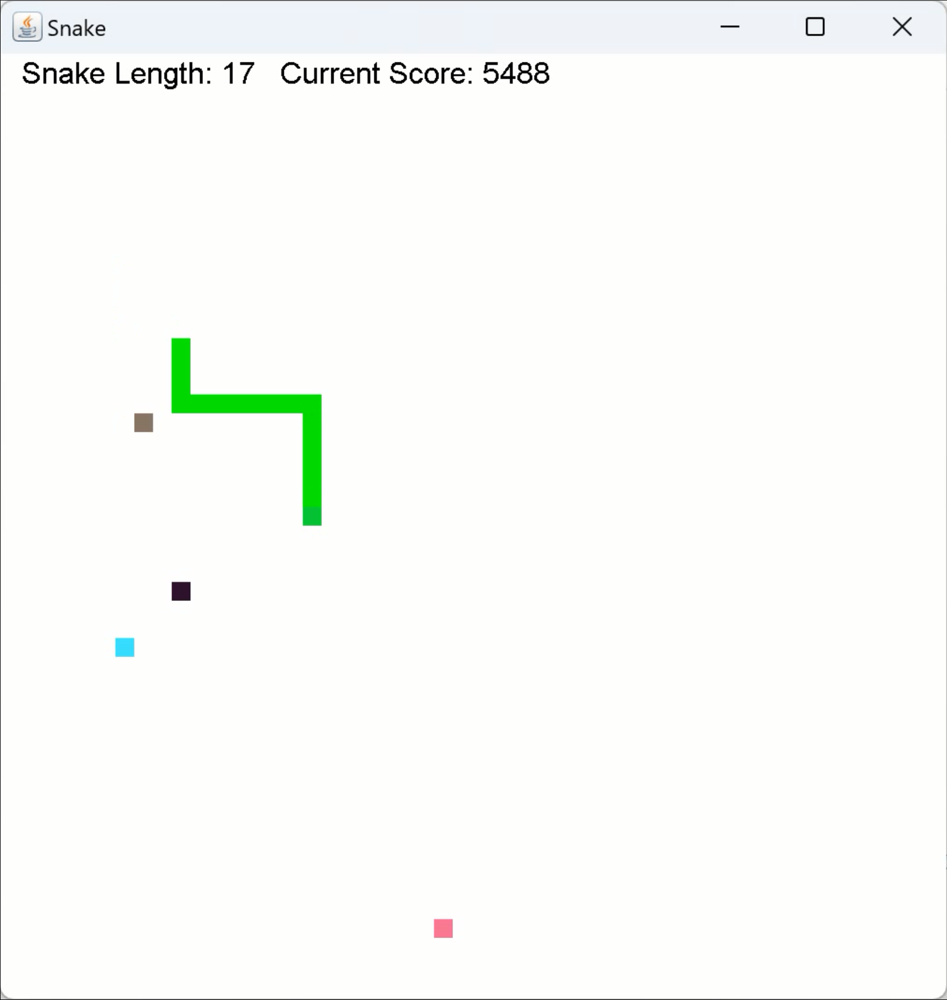

## 贪吃蛇 Snake 游戏介绍

</img>

&emsp;&emsp;如图所示为贪吃蛇游戏界面。游戏开始时，蛇拥有基础长度 $5$ 和基础分数 $2000$。蛇以速度 $1$ 从界面左上角向右移动，玩家可以按下如下方式操控蛇转向：
$\boxed{\mathrm W}$ 上 $\boxed{\mathrm S}$ 下 $\boxed{\mathrm A}$ 左 $\boxed{\mathrm D}$ 右

&emsp;&emsp;同时，也可以按下 $\boxed{\mathrm 1}$ ~ $\boxed{\mathrm 4}$ 控制蛇的速度。速度为 $1$ 时不消耗分数，其他速度均消耗分数，且速度越快，爬行单位距离消耗的分数也越多。\
&emsp;&emsp;$\boxed{\mathrm P}$ 暂停，再按一次继续；$\boxed{\mathrm R}$ 新一局游戏，可以在玩的过程中按下，也可以在 GamOver 后按下；$\boxed{\mathrm H}$ 隐藏/显示字幕。\
&emsp;&emsp;当答辩方块与蛇头相撞、蛇头碰到边界、蛇头碰到蛇身或者分数为 $0$ 时，游戏结束。\
&emsp;&emsp;游戏中的一些方块说明：

<table align="center">
    <tr>
        <th>颜色</th>
        <th>方块名</th>
        <th>说明</th>
    </tr>
    <tr>
        <td bgcolor="#45ebfc"></td>
        <td>奖励方块</td>
        <td>吃了得分 $500$，只有在被吃了之后才会消失，并生成新的。</td>
    </tr>
    <tr>
        <td bgcolor="#2d0e2d"></td>
        <td>惩罚方块</td>
        <td>吃了扣分 $400$，会消失、随机刷新，有接近 $0.8$ 的概率贴脸生成（在玩家前进方向前几格生成）。</td>
    </tr>
    <tr>
        <td bgcolor="EE6A91"></td>
        <td>彩蛋方块</td>
        <td>吃了加分 $1200$，会消失、随机刷新，且消失前 $0.8$ 秒闪烁。</td>
    </tr>
    <tr>
        <td bgcolor="442610"></td>
        <td>答辩方块</td>
        <td>会随机从边界生成并沿着直线移动，如果与蛇身相撞，丢失相撞位置到蛇尾的所有长度，每丢失 $1$ 单位长度扣 $300$ 分，至多扣至 $1000$ 分；若与蛇头相撞，GameOver。</td>
    </tr>
</table>

&emsp;&emsp;可能会出现少量 bug，此时跳过即可。
